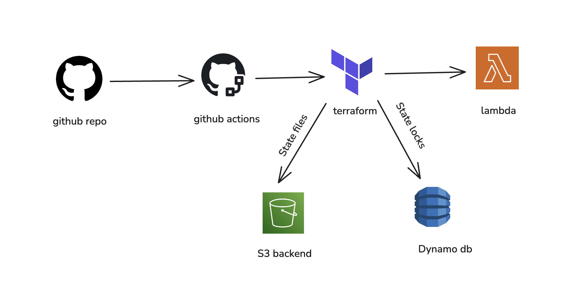

Serverless DevOps on AWS — CI/CD for Lambda using Terraform

This project demonstrates a modern Serverless DevOps pipeline that automatically builds and deploys an AWS Lambda function using GitHub Actions and Terraform.

Whenever you push code to the main branch, GitHub Actions triggers Terraform to:

1. Package your Lambda code into a .zip
2. Upload it to AWS
3. Create or update your Lambda infrastructure automatically

Tech Stack

| Layer                      | Technology     | Purpose                                         |
| -------------------------- | -------------- | ----------------------------------------------- |
| **Infrastructure as Code** | Terraform      | Manages Lambda, IAM, and backend state          |
| **CI/CD Pipeline**         | GitHub Actions | Automates deployment on push                    |
| **Cloud Provider**         | AWS            | Runs Lambda function and stores Terraform state |
| **Language**               | Python 3.9     | Lambda runtime                                  |
| **State Storage**          | S3 + DynamoDB  | Remote backend for Terraform                    |

Initialize Terraform (Local Setup)

In your terminal:

cd terraform
terraform init -reconfigure
terraform plan
terraform apply -auto-approve

This creates:

1. IAM Role
2. Lambda Function
3. Remote State Configuration

Configure GitHub Secrets

In your GitHub repo: Go to Settings → Secrets and variables → Actions

Add these secrets:

| Name                    | Description         |
| ----------------------- | ------------------- |
| `AWS_ACCESS_KEY_ID`     | Your AWS access key |
| `AWS_SECRET_ACCESS_KEY` | Your AWS secret key |

Learning Outcomes

After completing this project, you’ll understand:

How to create a serverless AWS Lambda from scratch
How to manage cloud infrastructure using Terraform
How to automate deployment with GitHub Actions
How to store and share Terraform state securely via S3
How to debug and maintain CI/CD pipelines end-to-end

